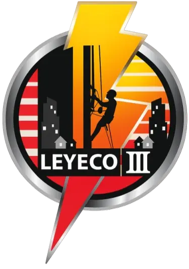
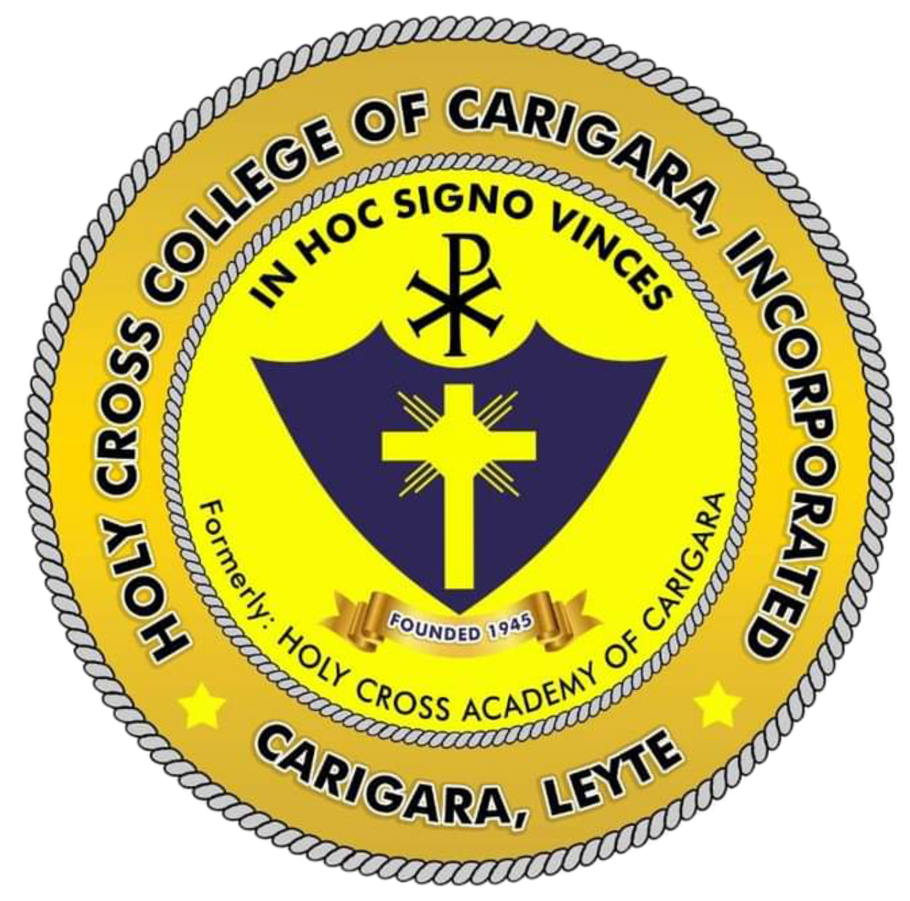

# <span style="background-color: #e74c3c; color: white; padding: 4px 8px; border-radius: 4px; font-weight: bold; display: inline-block; margin: 8px 0; vertical-align: middle;">LEYECO III TROUBLE REPORT SYSTEM</span>

[](https://opensource.org/licenses/MIT)
[](https://php.net/)
[](https://www.docker.com/)
[](https://www.mysql.com/)

A web-based application developed by Computer Science Seniors at Holy Cross College of Carigara Incorporated for LEYECO III (Leyte III Electric Cooperative) as a system project in fulfillment of our On-the-Job Training/Internship requirements.

## Project Overview 
This system enables LEYECO III Member-Consumer-Owners (MCOs) to report electrical service issues and power outages through an accessible online platform. It streamlines the trouble reporting process while providing cooperative staff with efficient tools for managing, tracking, and resolving MCO complaints.

## Key Features

### Public Access
- Submit and track trouble reports
- Photo uploads (JPG/PNG, max 5MB)
- Real-time status updates
- No login required for submissions

### Operator Tools
- Interactive dashboard
- Report management system
- Status workflow: NEW → INVESTIGATING → RESOLVED → CLOSED
- Full activity history

### Admin Console
- User and role management
- System analytics
- Audit logging
- Configuration settings


## Quick Start

### With Docker (Recommended)
```bash
git clone [repository-url] tracking_sys
cd tracking_sys
docker-compose up -d
```

Access the application:
- Web Interface: http://localhost:8080
- phpMyAdmin: http://localhost:8081

### Default Logins
- **Admin**: admin@example.com / admin123
- **Operator**: operator@example.com / operator123

> **Security Note**: Change default passwords immediately after first login!

## License

This project is licensed under the MIT License. See the [LICENSE.md](LICENSE.md) file for details.

---

## <span style="background-color: #f5c608d2; color: white; padding: 4px 8px; border-radius: 4px; font-weight: bold; display: inline-block; margin: 8px 4px 8px 0; vertical-align: middle;">Credits</span><span>HCCCI Computer Science Seniors</span>

#### Documentation & QA/Testers:
- Sophia Caridad
- Loren Mae Pascual
- Fauna Dea Opetina
- Agnes Osip
- Zxyrah Mae Indemne

#### <span style="background-color: #072d9fd2; color: white; padding: 2px 6px; border-radius: 4px; font-weight: bold; display: inline-block; margin: 4px 0; vertical-align: middle;">Developer</span> Jaderby Peñaranda
[](https://jaderbypenaranda.link/) [](mailto:jaderbypenaranda@gmail.com)

---

*Built for LEYECO III - Lighting Houses, Lighting Homes, Lighting Hopes*

---

**Version**: 1.0.1  
**Last Updated**: December 5, 2025
